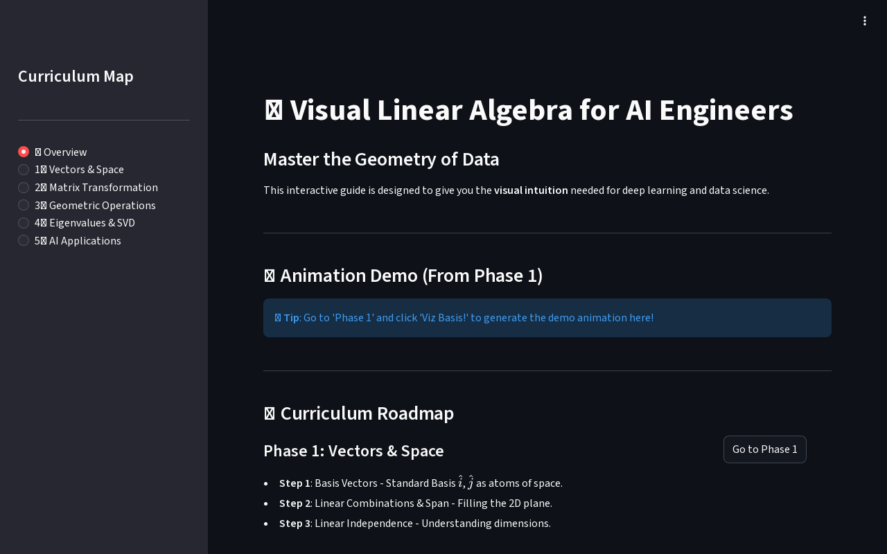
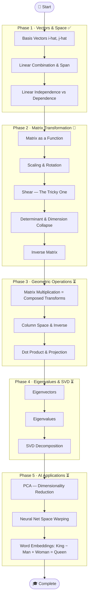
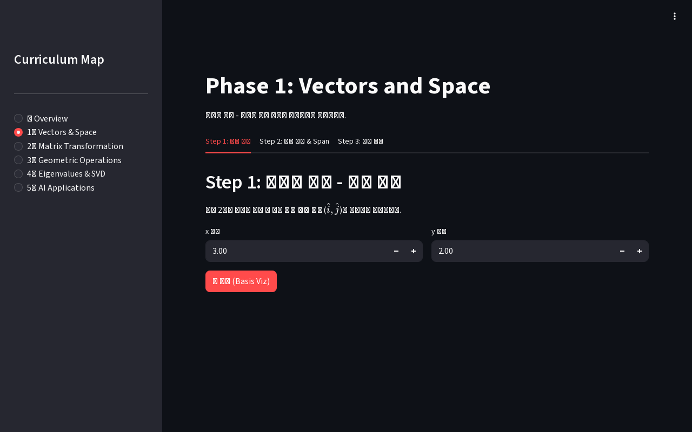

# 📐 Visual Linear Algebra for AI Engineers

> **See math move.** An interactive platform to build visual intuition for deep learning — one transformation at a time.

<div align="center">

## 🌐 [viz.bit-habit.com](https://viz.bit-habit.com) — Live Now

[](https://viz.bit-habit.com)
[](https://viz.bit-habit.com)
[](https://viz.bit-habit.com)

</div>

---



---

## 🎯 Goal

Modern AI (Transformers, CNNs) is fundamentally **matrix operations on high-dimensional spaces**.
Most engineers learn the formulas but miss the geometry.

This project builds that missing visual intuition — from vectors to eigenvalues to neural networks —
using **Manim animations rendered on demand** inside a **Streamlit interactive UI**.

---

## 🗺️ Learning Flow



---

## 📋 Curriculum Status

### Phase 1 — Vectors & Space

| Step | Topic | Key Idea | Status |
|------|-------|----------|--------|
| 1 | Basis Vectors | $\hat{i}$, $\hat{j}$ as the atoms of space | ✅ Done |
| 2 | Linear Combination & Span | Filling 2D plane vs. collapsing to a line | ✅ Done |
| 3 | Linear Independence | Does the 3rd vector escape to a new dimension? | ✅ Done |

### Phase 2 — Matrix Transformation

| Step | Topic | Key Idea | Status |
|------|-------|----------|--------|
| 4 | Scaling | Grid stretches along x/y axes | 🚧 In Progress |
| 5 | Rotation | Origin fixed, angles preserved | 🚧 In Progress |
| 6 | Shear | Floor stays put, layers slide sideways | 🚧 In Progress |
| 7 | Determinant | Area scaling factor; det=0 means collapse | 🚧 In Progress |
| 8 | Inverse Matrix | Rewind the transformation | 🚧 In Progress |

### Phase 3 — Geometric Operations

| Step | Topic | Key Idea | Status |
|------|-------|----------|--------|
| 9 | Matrix Multiplication | AB = apply B then A (order matters!) | ⏳ Waiting |
| 10 | Column Space & Inverse | All reachable output vectors | ⏳ Waiting |
| 11 | Dot Product & Projection | Similarity as shadow length | ⏳ Waiting |

### Phase 4 — Eigenvalues & SVD

| Step | Topic | Key Idea | Status |
|------|-------|----------|--------|
| 12 | Eigenvectors | Axes that only stretch, never rotate | ⏳ Waiting |
| 13 | Eigenvalues | The stretch factor along each eigenvector | ⏳ Waiting |
| 14 | SVD | Any matrix = Rotate → Scale → Rotate | ⏳ Waiting |

### Phase 5 — AI Applications

| Step | Topic | Key Idea | Status |
|------|-------|----------|--------|
| 15 | PCA | Find the axis of maximum variance | ⏳ Waiting |
| 16 | Neural Net Space Warping | Layers = linear transform + ReLU fold | ⏳ Waiting |
| 17 | Word Embeddings | Vector arithmetic in semantic space | ⏳ Waiting |

---

## 🏗️ Infrastructure

| Component | Detail | Purpose |
|-----------|--------|---------|
| **Server** | OCI Ampere A1 (ARM64) | Cost-efficient rendering node |
| **Container** | Docker Compose | Bundles ffmpeg, pango, Manim dependencies |
| **Frontend** | Streamlit | Interactive UI for matrix input & video playback |
| **Renderer** | Manim CE 480p15 | On-demand math animation generation |
| **Orchestration** | **k3s** *(in progress)* | Lightweight Kubernetes for multi-node scaling |

---

## 🚀 Quick Start

```bash
# Run with Docker
docker-compose up --build

# Run locally
pip install -r requirements.txt
streamlit run app.py
```

---


