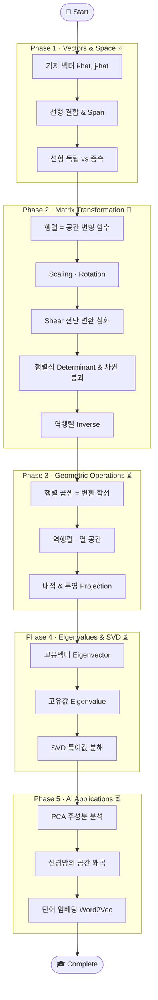

# 📐 Visual Linear Algebra for AI Engineers

> **공간의 변형을 눈으로 이해한다** — AI 엔지니어를 위한 인터랙티브 선형대수 시각화 플랫폼

---

## 🎯 프로젝트 목표

딥러닝의 핵심은 **고차원 데이터를 특정 목적에 맞게 변형(Transform)** 하는 과정이다.
트랜스포머, CNN 등 현대 AI 모델은 결국 거대한 행렬들의 연산이며, 그 본질은 **공간을 구부리고 늘리는 선형대수의 기하학**에 있다.

이 프로젝트는 수식 암기가 아닌 **시각적 직관**으로 선형대수를 정복하기 위해 만들어졌다.
[Manim](https://www.manim.community/) 애니메이션과 [Streamlit](https://streamlit.io/) 인터랙티브 UI를 결합하여,
**벡터 → 행렬 변환 → 고유값 분해 → AI 응용**까지 20개의 핵심 개념을 단계적으로 체험한다.

- 🌐 **플랫폼**: OCI Ampere A1 (ARM64) + Docker + Streamlit
- 🎬 **렌더링**: Manim Community Edition (480p, 실시간 생성)
- 📍 **배포 목표**: [viz.bit-habit.com](https://viz.bit-habit.com)

---

## 🗺️ 학습 흐름 (Learning Flow)



---

## 📋 커리큘럼 진행 현황

### Phase 1 — Vectors & Space

| Step | 주제 | 핵심 개념 | Status |
|------|------|-----------|--------|
| 1 | 기저 벡터 (Basis Vectors) | $\hat{i}$, $\hat{j}$ — 공간의 원자 | ✅ Done |
| 2 | 선형 결합 & Span | 두 벡터로 2D 평면 채우기 / 1D 붕괴 | ✅ Done |
| 3 | 선형 독립 vs 종속 | 새로운 차원 탈출 여부 (3D 시각화) | ✅ Done |

### Phase 2 — Matrix Transformation

| Step | 주제 | 핵심 개념 | Status |
|------|------|-----------|--------|
| 4 | Scaling (확대/축소) | 격자가 가로/세로로 늘어나는 변환 | 🚧 In Progress |
| 5 | Rotation (회전) | 원점 고정 + 각도 유지 회전 | 🚧 In Progress |
| 6 | Shear (전단 변환) | 층 밀림 — 바닥 고정, 위로 갈수록 이동 | 🚧 In Progress |
| 7 | Determinant & 차원 붕괴 | 면적 변화율 / det=0 이면 공간 붕괴 | 🚧 In Progress |
| 8 | Inverse (역행렬) | 뒤틀린 공간을 원래대로 되돌리기 | 🚧 In Progress |

### Phase 3 — Geometric Operations

| Step | 주제 | 핵심 개념 | Status |
|------|------|-----------|--------|
| 9 | 행렬 곱셈 | 변환의 합성 (AB ≠ BA 이유) | ⏳ Waiting |
| 10 | 역행렬 & 열 공간 | 선형 시스템 풀기, Column Space | ⏳ Waiting |
| 11 | 내적 & 투영 | 유사도 측정 / Attention 메커니즘 기초 | ⏳ Waiting |

### Phase 4 — Eigenvalues & SVD

| Step | 주제 | 핵심 개념 | Status |
|------|------|-----------|--------|
| 12 | 고유벡터 (Eigenvector) | 변환 후에도 방향 불변인 특별한 축 | ⏳ Waiting |
| 13 | 고유값 (Eigenvalue) | 고유벡터 방향의 확장/축소 비율 | ⏳ Waiting |
| 14 | SVD (특이값 분해) | 복잡한 행렬 → 회전·스케일·회전 분해 | ⏳ Waiting |

### Phase 5 — AI Applications

| Step | 주제 | 핵심 개념 | Status |
|------|------|-----------|--------|
| 15 | PCA (주성분 분석) | 데이터 분산 최대 축 찾기 & 차원 축소 | ⏳ Waiting |
| 16 | 신경망의 공간 왜곡 | 레이어 = 선형 변환 + ReLU 비선형 접기 | ⏳ Waiting |
| 17 | 단어 임베딩 | King − Man + Woman = Queen (벡터 산술) | ⏳ Waiting |

---

## 🏗️ 기술 스택

| 구성 요소 | 상세 | 목적 |
|-----------|------|------|
| **Architecture** | ARM64 (OCI Ampere A1) | 저비용 고효율 렌더링 서버 |
| **Container** | Docker Compose | ffmpeg, pango 등 라이브러리 호환성 확보 |
| **Frontend** | Streamlit | 행렬 값 입력 & 비디오 재생 UI |
| **Rendering** | Manim CE (480p15) | 실시간 수학 애니메이션 생성 |

## 🚀 빠른 시작

```bash
# Docker로 실행
docker-compose up --build

# 로컬 실행 (Python 환경)
pip install -r requirements.txt
streamlit run app.py
```
